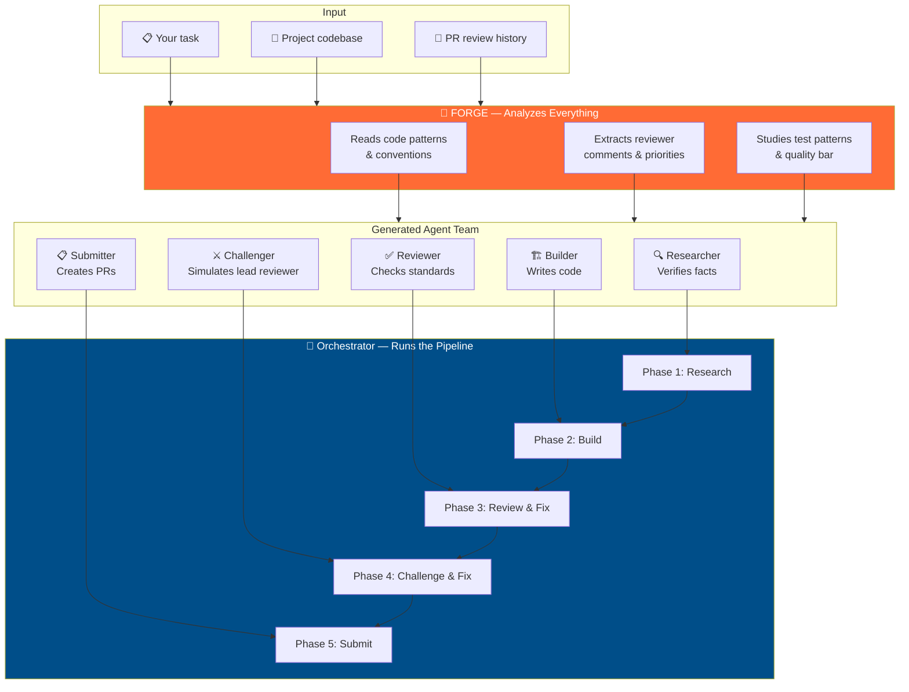
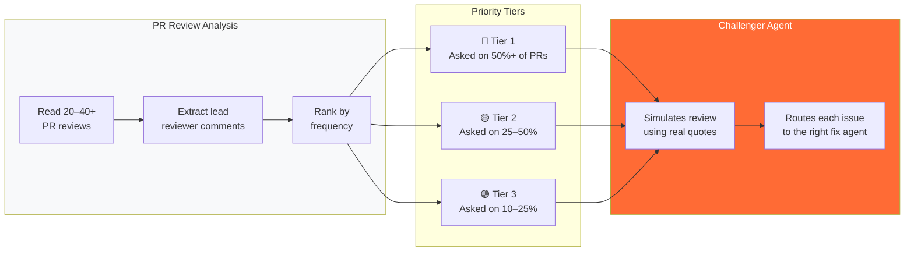
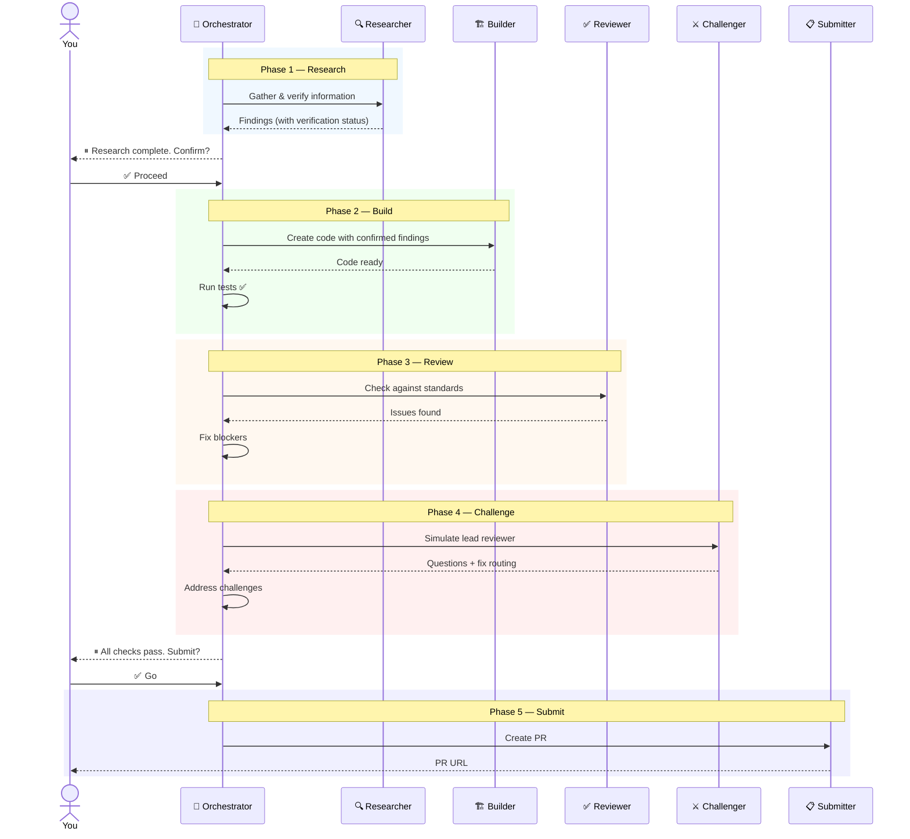

# Claude Forge

**One agent that builds an army.**

Claude Forge analyzes any project — its codebase, conventions, PR review history, and your task — then creates a team of specialized [Claude Code](https://docs.anthropic.com/en/docs/claude-code) agents orchestrated to complete the work at the project's quality bar.

<br>

<div align="center">

```
You + Task + Context  →  Forge  →  Agent Team  →  Orchestrated Pipeline  →  Result
```

</div>

<br>

## Overview

Most AI coding tools generate code. Claude Forge generates **the agents that generate the code** — each one specialized, grounded in the actual project, and chained into a pipeline with quality checks and human approval gates.



<br>

## Quick Start

### 1. Install the Forge

```bash
# Clone the repo
git clone https://github.com/pablocaeg/claude-forge.git

# Copy the forge agent to your Claude Code agents directory
cp claude-forge/forge.md ~/.claude/agents/
```

### 2. Prepare Your Task (optional)

Create a `.context/` folder in your project with relevant information:

```
your-project/
├── .context/
│   ├── task.md              # What you want to accomplish
│   ├── research/            # Background docs, specs, references
│   └── examples/            # Examples of desired output
└── src/                     # Your project files
```

> The `.context/` folder is optional. The forge can analyze the project and task from your prompt alone. But providing context produces better agents.

### 3. Run the Forge

```
@forge Analyze this project and build agents for: [describe your task]
```

The forge reads your project, studies its PR history, and creates a complete agent team in `~/.claude/agents/`.

### 4. Execute the Pipeline

```
@[project]-orchestrator Go
```

The orchestrator runs each agent in sequence, with human checkpoints at critical decisions.

<br>

## What Gets Created

Every agent team is tailored to the specific project. The forge reads the actual codebase and designs agents grounded in its patterns — not generic templates.

| Agent | Purpose | How It's Customized |
|-------|---------|-------------------|
| **Researcher** | Gathers and verifies information | Knows what data the builder needs, verifies against project requirements |
| **Builder** | Creates code matching project conventions | Templates from actual project files, follows exact naming and structure |
| **Reviewer** | Checks against project standards | Uses the project's real linter config, test conventions, PR checklist |
| **Challenger** | Simulates the lead reviewer | Built from their actual PR comments, ranked by how often they raise each concern |
| **Submitter** | Creates polished PRs | Matches the format from the project's best accepted PRs |
| **Orchestrator** | Chains everything together | Dependencies between agents, test runs between phases, human approval gates |
| **Expert** | Answers codebase questions | Architecture map and entry points from the actual project |
| **Test Writer** | Writes tests matching conventions | Uses the project's assertion library, fixture patterns, coverage requirements |

<br>

## Key Features

### Reviewer Modeling

The forge doesn't just lint code. It reads the project's PR review history — extracting the lead reviewer's actual comments, ranking them by frequency, and building a challenger agent that asks the same questions they would ask.



> **Why this matters:** A typical PR goes through 2–3 review rounds. The challenger catches the reviewer's likely concerns *before* submission, reducing round trips.

<br>

### Self-Verifying Research

Research agents don't just search — they prove their findings. Wrong research produces wrong code, so verification is mandatory.

| Verification | How It Works |
|---|---|
| **Algorithms** | Computes step-by-step proofs against known valid data |
| **Sources** | Fetches every URL to confirm it's accessible and contains the claimed info |
| **Facts** | Cross-references from 2+ independent official sources |
| **Status** | Every finding tagged: ✅ Verified, ⚠️ Partial, ❌ Unverified |

```
Example — verifying a checksum algorithm:

  Input:  00177041
  Weights: [8, 7, 6, 5, 4, 3, 2]
  Step 1:  0×8 + 0×7 + 1×6 + 7×5 + 7×4 + 0×3 + 4×2 = 77
  Step 2:  11 - (77 mod 11) = 11 → edge case → 1
  Step 3:  Last digit = 1 ✓

  Status: ✅ Verified against 5 real IDs
```

<br>

### Orchestrated Execution

Agents run in a managed pipeline — not independently. Each phase depends on the previous one, with automated test runs and human approval gates.



<br>

## Design Principles

| Principle | What It Means |
|-----------|--------------|
| **Ground in reality** | Every agent prompt contains patterns from the actual project — never generic templates |
| **Model the reviewer** | The challenger uses the lead reviewer's real words, ranked by how often they raise each concern |
| **Verify, don't trust** | Research agents prove findings with step-by-step computations and source verification |
| **Minimum tools** | Each agent gets only what it needs — read-only agents can't modify files |
| **Human checkpoints** | The pipeline pauses for approval after research and before submission |
| **Anti-patterns are critical** | Telling agents what NOT to do prevents the most common mistakes |
| **Test and iterate** | The first version of every agent is wrong — test on real work, then improve |

<br>

## Project Structure

```
claude-forge/
├── forge.md                   # The forge agent ← install this
├── templates/                 # Agent archetypes the forge customizes
│   ├── researcher.md          #   Self-verifying research
│   ├── builder.md             #   Pattern-matching code creation
│   ├── reviewer.md            #   Standards-based review
│   ├── challenger.md          #   Lead reviewer simulation
│   ├── submitter.md           #   PR/deliverable creation
│   ├── orchestrator.md        #   Pipeline coordination
│   ├── expert.md              #   Codebase navigation
│   └── test-writer.md         #   Convention-matching tests
├── docs/
│   ├── context-guide.md       #   How to structure .context/ folders
│   ├── methodology.md         #   The thinking behind the approach
│   └── customization.md       #   How to modify generated agents
├── LICENSE
└── README.md
```

<br>

## Requirements

| Requirement | Purpose |
|---|---|
| [Claude Code](https://docs.anthropic.com/en/docs/claude-code) | Runs the agents |
| [GitHub CLI](https://cli.github.com/) (`gh`) | PR analysis and submission |
| A project to work on | The forge needs a real codebase to analyze |

<br>

## How It Compares

| Approach | What You Get |
|----------|-------------|
| **Generic AI assistant** | One-size-fits-all code that often fails review |
| **Custom CLAUDE.md** | Better context, but still one agent doing everything |
| **Claude Forge** | Specialized agents grounded in the project, orchestrated with quality gates, simulating the actual reviewer |

<br>

## License

MIT

<br>

---

<div align="center">

Built by [Pablo Carrasco](https://github.com/pablocaeg)

*Not prompt engineering. Agent engineering.*

</div>
