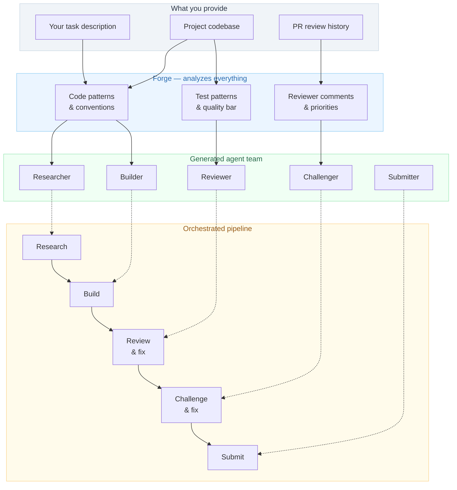
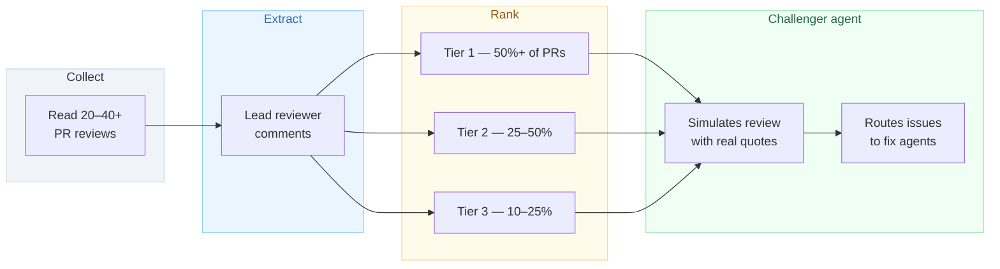
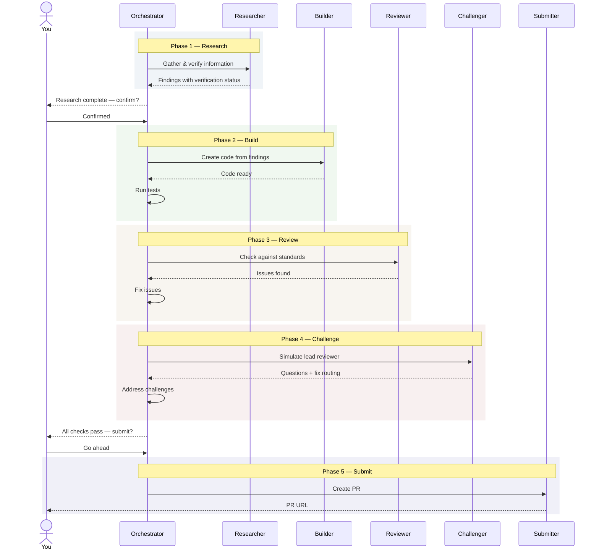

# Claude Forge

A Claude Code agent that helps you set up teams of specialized agents for your projects.

It reads your codebase, looks at how the project's PR reviews work, and creates agents tailored to the project's conventions — so you spend less time learning patterns and more time contributing.

<br>

## What It Does

Instead of one general-purpose AI assistant, the forge creates a small team of focused agents — each one grounded in the actual project's code, tests, and review expectations.



<br>

## Quick Start

### 1. Install the Forge

```bash
git clone https://github.com/pablocaeg/claude-forge.git
cp claude-forge/forge.md ~/.claude/agents/
```

### 2. Prepare Your Task (optional)

Create a `.context/` folder in your project with relevant information:

```
your-project/
├── .context/
│   ├── task.md              # What you want to accomplish
│   ├── research/            # Background docs, specs, references
│   └── examples/            # Examples of desired output
└── src/                     # Your project files
```

> The `.context/` folder is optional. The forge can analyze the project and task from your prompt alone. But providing context produces better agents.

### 3. Run the Forge

```
@forge Analyze this project and build agents for: [describe your task]
```

The forge reads your project, studies its PR history, and creates a complete agent team in `~/.claude/agents/`.

### 4. Execute the Pipeline

```
@[project]-orchestrator Go
```

The orchestrator runs each agent in sequence, with human checkpoints at critical decisions.

<br>

## What Gets Created

Every agent team is tailored to the specific project. The forge reads the actual codebase and designs agents grounded in its patterns — not generic templates.

| Agent | Purpose | How It's Customized |
|-------|---------|-------------------|
| **Researcher** | Gathers and verifies information | Knows what data the builder needs, verifies against project requirements |
| **Builder** | Creates code matching project conventions | Templates from actual project files, follows exact naming and structure |
| **Reviewer** | Checks against project standards | Uses the project's real linter config, test conventions, PR checklist |
| **Challenger** | Simulates the lead reviewer | Built from their actual PR comments, ranked by how often they raise each concern |
| **Submitter** | Creates polished PRs | Matches the format from the project's best accepted PRs |
| **Orchestrator** | Chains everything together | Dependencies between agents, test runs between phases, human approval gates |
| **Expert** | Answers codebase questions | Architecture map and entry points from the actual project |
| **Test Writer** | Writes tests matching conventions | Uses the project's assertion library, fixture patterns, coverage requirements |

<br>

## Interesting Parts

### Reviewer Modeling

One thing I found useful while building this: reading through a project's PR review history teaches you more than reading the source code. The forge tries to capture that by extracting the lead reviewer's actual comments and building an agent that raises similar concerns before you submit.



> The idea is to catch likely review feedback before submitting, which can save a few round trips.

<br>

### Self-Verifying Research

I kept running into a problem where research agents would confidently return wrong data — and that wrong data would end up in the code. So the research agent now has a verification step: it cross-references sources and shows its work.

| Verification | How It Works |
|---|---|
| **Algorithms** | Computes step-by-step proofs against known valid data |
| **Sources** | Fetches every URL to confirm it's accessible and contains the claimed info |
| **Facts** | Cross-references from 2+ independent official sources |
| **Status** | Every finding tagged: Verified Verified, Partial Partial, Unverified Unverified |

<br>

### Orchestrated Execution

Agents run in a managed pipeline — not independently. Each phase depends on the previous one, with test runs between phases and human approval gates at key decisions.



<br>

## Things I Learned Building This

| Lesson | Details |
|--------|---------|
| **Project-specific prompts matter** | Generic agents produce generic output. Agents grounded in the actual codebase do much better. |
| **PR reviews are the best teacher** | Reading 20+ reviews taught the agents more than reading every source file. |
| **Research needs verification** | If the research agent gets something wrong, everything downstream is wrong. Self-verification helps. |
| **Restrict tools per agent** | Read-only agents shouldn't be able to write files. Fewer tools = fewer mistakes. |
| **Humans should approve key decisions** | The pipeline pauses after research and before submission. Fully autonomous is tempting but risky. |
| **Say what NOT to do** | Anti-patterns prevent the most common mistakes better than positive instructions alone. |
| **First version is always wrong** | Test agents on real work, find what breaks, improve. Repeat. |

<br>

## Project Structure

```
claude-forge/
├── forge.md                   # The forge agent ← install this
├── templates/                 # Agent archetypes the forge customizes
│   ├── researcher.md          #   Self-verifying research
│   ├── builder.md             #   Pattern-matching code creation
│   ├── reviewer.md            #   Standards-based review
│   ├── challenger.md          #   Lead reviewer simulation
│   ├── submitter.md           #   PR/deliverable creation
│   ├── orchestrator.md        #   Pipeline coordination
│   ├── expert.md              #   Codebase navigation
│   └── test-writer.md         #   Convention-matching tests
├── docs/
│   ├── context-guide.md       #   How to structure .context/ folders
│   ├── methodology.md         #   The thinking behind the approach
│   └── customization.md       #   How to modify generated agents
├── LICENSE
└── README.md
```

<br>

## Requirements

| Requirement | Purpose |
|---|---|
| [Claude Code](https://docs.anthropic.com/en/docs/claude-code) | Runs the agents |
| [GitHub CLI](https://cli.github.com/) (`gh`) | PR analysis and submission |
| A project to work on | The forge needs a real codebase to analyze |

<br>

## Limitations

This is an experiment, not a production tool. Some honest caveats:

- **Claude Code only** — these agents don't work with other AI coding tools
- **One project tested thoroughly** — the methodology works, but more real-world testing is needed
- **Agents need iteration** — the forge produces a good first draft, but you'll want to refine after testing
- **Not truly autonomous** — you still need to review, approve, and guide the pipeline

## Contributing

This is a work in progress. If you try it on a project and find ways to improve it, PRs and issues are welcome.

## License

MIT
