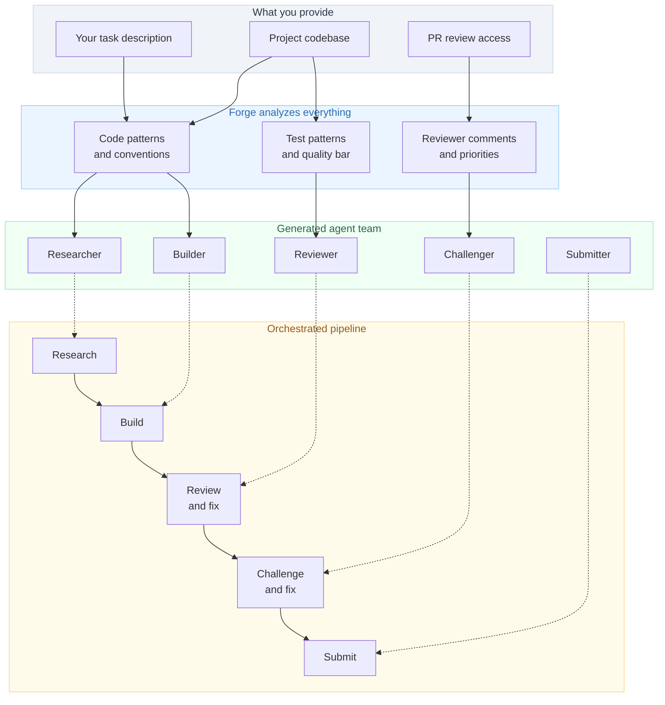
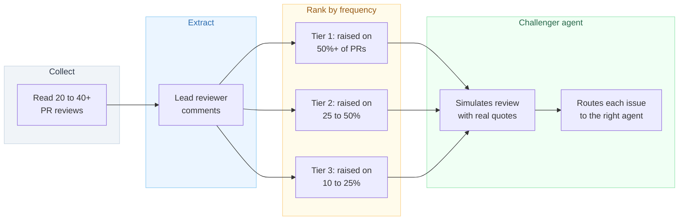
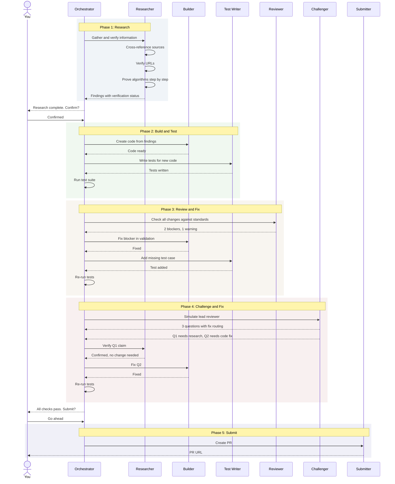

# Claude Forge

A Claude Code plugin that reads your project and creates a team of specialized agents for it.

It looks at the codebase, studies how PR reviews work in the project, and generates agents that understand the project's actual conventions, not generic ones.

<br>

## What It Does

You get a small team of agents, each focused on one job, built from the project's real code and review patterns.



<br>

## Quick Start

### 1. Install

```bash
# As a Claude Code plugin
claude plugin install claude-forge --scope user

# Or manually
git clone https://github.com/pablocaeg/claude-forge.git
claude --plugin-dir claude-forge
```

### 2. Analyze the Project

```
/claude-forge:analyze
```

Reads the codebase and PR reviews. Extracts the lead reviewer's actual comments and ranks them by how often they come up. Saves the analysis to `.context/forge-analysis.md`.

### 3. Create the Agent Team

```
/claude-forge:create-team
```

Uses the analysis to generate agents in `~/.claude/agents/`. They live outside the plugin so they can spawn each other during orchestration.

### 4. Run the Pipeline

```
@[project]-orchestrator [describe your task]
```

Runs each agent in order with human checkpoints at key decisions.

### 5. Pre-check Before Submitting (optional)

```
/claude-forge:challenge
```

Simulates the lead reviewer's feedback on your current changes before you submit.

<br>

## What Gets Created

Every team is different. The forge reads the actual codebase and builds agents around its patterns.

| Agent | What it does | What makes it project-specific |
|-------|-------------|-------------------------------|
| **Researcher** | Gathers and verifies information | Knows what the builder needs, verifies against project requirements |
| **Builder** | Writes code | Uses templates from real project files, follows naming and structure |
| **Reviewer** | Checks against standards | Uses the project's linter config, test conventions, PR checklist |
| **Challenger** | Simulates the lead reviewer | Built from their actual comments, ranked by frequency |
| **Submitter** | Creates PRs | Matches the format from the project's best accepted PRs |
| **Orchestrator** | Runs the pipeline | Chains agents with test runs between phases and human approval gates |
| **Expert** | Answers codebase questions | Architecture map and entry points from the actual project |
| **Test Writer** | Writes tests | Uses the project's assertion library, fixture patterns, coverage target |

<br>

## Interesting Parts

### Reviewer Modeling

One thing I found useful while building this: reading through a project's PR reviews teaches you more than reading the source code. The forge captures that by extracting the lead reviewer's actual comments and building an agent that raises the same concerns before you submit.



The idea is to catch likely feedback before submitting, which can save a few review rounds.

<br>

### Self-Verifying Research

I kept running into a problem where the research agent would confidently return wrong data, and that wrong data would end up in the code. So the research agent now verifies its own findings before passing them on.

| What it verifies | How |
|-----------------|-----|
| Algorithms | Computes step by step against known valid data |
| Sources | Fetches every URL to confirm it loads and has the right content |
| Facts | Cross-references from 2+ independent official sources |
| Status | Tags every finding: verified, partial, or unverified |

<br>

### Orchestrated Execution

Agents run in a managed pipeline, not independently. Each phase depends on the previous one. The orchestrator runs tests between phases and pauses for human approval at key moments.



<br>

## Things I Learned Building This

| Lesson | Details |
|--------|---------|
| Project-specific prompts matter | Generic agents produce generic output. Grounding them in the actual codebase makes a big difference. |
| PR reviews are the best teacher | Reading 20+ reviews taught the agents more than reading every source file. |
| Research needs verification | If the research agent gets something wrong, everything downstream is wrong too. |
| Restrict tools per agent | Read-only agents should not be able to write files. Fewer tools, fewer mistakes. |
| Humans should approve key decisions | The pipeline pauses after research and before submission. Full autonomy is tempting but risky. |
| Say what NOT to do | Telling agents what to avoid prevents mistakes better than only telling them what to do. |
| First version is always wrong | Test agents on real work, find what breaks, fix them. Repeat. |

<br>

## Project Structure

```
claude-forge/
├── .claude-plugin/
│   └── plugin.json            # Plugin manifest
├── skills/
│   ├── analyze/
│   │   └── SKILL.md           # /claude-forge:analyze
│   ├── create-team/
│   │   └── SKILL.md           # /claude-forge:create-team
│   └── challenge/
│       └── SKILL.md           # /claude-forge:challenge
├── templates/                 # Agent archetypes used by create-team
│   ├── researcher.md
│   ├── builder.md
│   ├── reviewer.md
│   ├── challenger.md
│   ├── submitter.md
│   ├── orchestrator.md
│   ├── expert.md
│   └── test-writer.md
├── forge.md                   # Standalone agent (alternative to plugin)
├── docs/
│   ├── context-guide.md
│   ├── methodology.md
│   └── customization.md
├── LICENSE
└── README.md
```

<br>

## Requirements

| Requirement | Purpose |
|---|---|
| [Claude Code](https://docs.anthropic.com/en/docs/claude-code) | Runs the plugin and agents |
| [GitHub CLI](https://cli.github.com/) (`gh`) | PR review analysis and submission |
| A project to work on | The forge needs a real codebase to analyze |

<br>

## Limitations

This is an experiment, not a production tool. Some honest caveats:

- Works with Claude Code only. Other AI coding tools are not supported.
- Tested thoroughly on one project so far. The methodology works, but more testing would help.
- The forge produces a solid first draft of agents, but you will want to refine them after testing on real work.
- Not fully autonomous. You still review, approve, and guide the pipeline.

## Contributing

This is a work in progress. If you try it on a project and find ways to improve it, PRs and issues are welcome.

## License

MIT
